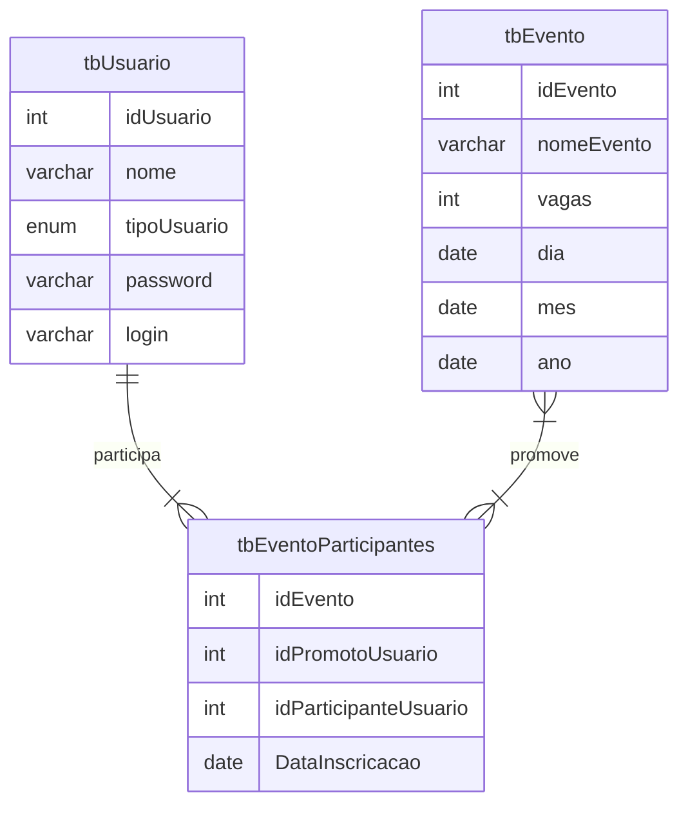

# Digrama de Entidade relacionamento.

## Banco de dados Event Planner

```mermaid

erDiagram

    tbUsuario{
        int idUsuario
        varchar nome
        enum tipoUsuario
        varchar password
        varchar login
    }
    tbEvento{
        int idEvento
        varchar nomeEvento
        int vagas
        date dia
        date mes
        date ano
    }
    tbEventoParticipantes{
        int idEvento
        int idPromotoUsuario
        int idParticipanteUsuario
        date DataInscricacao

    }
    tbUsuario ||--|{ tbEventoParticipantes: participa
    tbEvento }|--|{ tbEventoParticipantes: promove
```