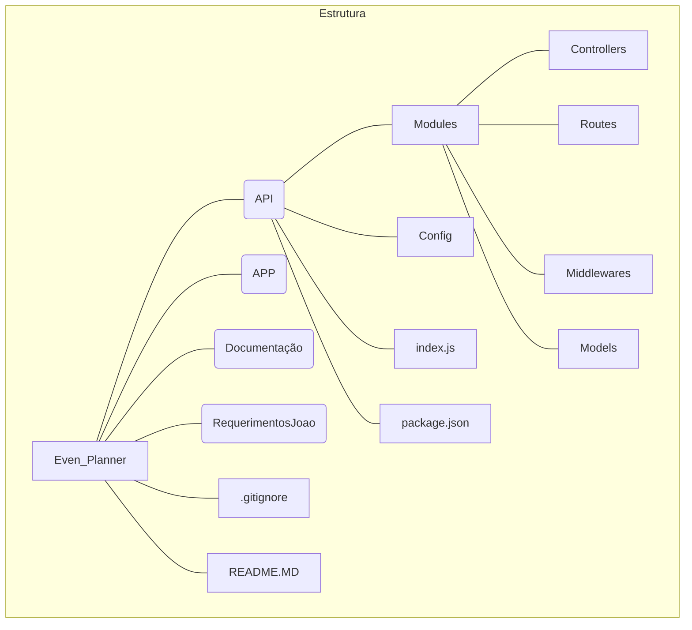

# Visão Geral

O **Event_Planner** é uma aplicação de gerenciamento de eventos que permite aos usuários criar, visualizar, editar e deletar eventos. Além disso, oferece funcionalidades para gerenciar participantes, incluindo adicionar, visualizar, editar e remover participantes de eventos.

## Estrutura do Event Planner

```
Api/
│
├── Modules/
    ├── controllers/
    │   └── (controladores da API)
    ├── models/
    │   └── (modelos de dados)
    ├── routes/
    │   └── (rotas da API)
    └── middlewares/
       └── (middlewares da aplicação)
```

- **Modules/**: Esta pasta contém o código principal da aplicação.
  - **controllers/**: Aqui estão os controladores que lidam com as requisições HTTP e interagem com os modelos de dados.
  - **models/**: Os modelos de dados representam a estrutura dos objetos manipulados pela aplicação.
  - **routes/**: Define as rotas da API e associa cada rota a um controlador.
  - **middlewares/**: Middlewares são funções que têm acesso ao objeto de solicitação (request), ao objeto de resposta (response) e à próxima função middleware no ciclo de solicitação-resposta do aplicativo.

- **config/**: Pasta para arquivos de configuração, como configurações de banco de dados, chaves de API, etc.

- **node_modules/**: Pasta onde as dependências do Node.js são instaladas (ignorada pelo Git).

- **public/**: Contém arquivos estáticos que podem ser servidos diretamente pelo Express, como HTML, CSS e JavaScript.

- **tests/**: Aqui você pode armazenar os testes automatizados para sua aplicação.

- **package.json**: Arquivo de manifesto do projeto que inclui informações sobre o projeto e suas dependências.

- **.gitignore**: Arquivo que lista os arquivos e diretórios a serem ignorados pelo Git.

- **app.js** (ou **index.js**): O arquivo principal que inicia a aplicação Express.

- **README.md**: Arquivo que descreve o projeto, sua estrutura e instruções para executá-lo.
