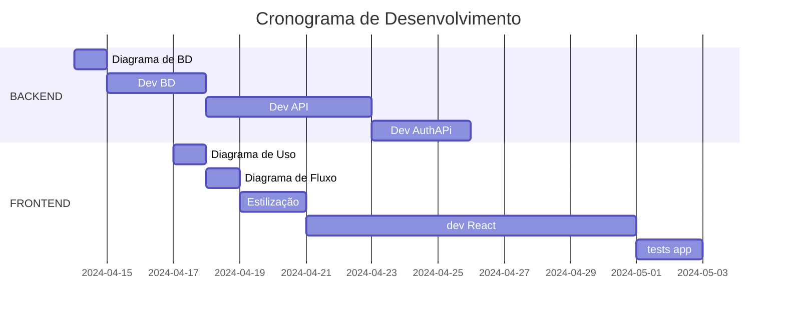

# Trabalho de Tópicos Avançados

Entrega via apresentação em sala de aula: 03/05/2024
Trabalho realizado com no máximo 3 alunos

***NOTE***
## Descrição
Desenvolva uma aplicação de gerenciamento de eventos, onde os usuários podem criar, visualizar, editar e
deletar eventos. Além disso, haverá uma funcionalidade para gerenciar participantes, permitindo adicionar,
visualizar, editar e remover participantes de eventos. Esta aplicação consistirá em uma API backend construída
com Node.js e um frontend construído com React.
### Requisitos do Backend (Node.js)
1. **API RESTful**: Crie uma API usando Express.js (para REST) que suportará as operações CRUD para
eventos e participantes.
2. **Banco de dados**: Utilize MongoDB, PostgreSQL ou MySQL para armazenar dados dos eventos e
participantes. Defina modelos de dados apropriados para cada um.
3. **Autenticação**: Implemente autenticação JWT para proteger as rotas da API, garantindo que apenas
usuários autenticados possam criar, atualizar ou deletar eventos e participantes.
### Requisitos do Frontend (React)
1. **Páginas**: Desenvolva páginas para listar eventos, visualizar detalhes de um evento, criar/editar um
evento, listar participantes de um evento, e adicionar/editar participantes.
2. **Roteamento**: Utilize React Router para gerenciar navegação entre as páginas.
3. **Estado Global**: Gerencie o estado global da aplicação (como a autenticação do usuário) usando
Context API ou Redux.
4. **Ferramentas de design**: Escolha e utilize uma das seguintes tecnologias de design para construir a
interface do usuário: Material-UI, Chakra UI, Tailwind CSS, Shadcn/ui, Primedesign e Blueprint;
# Entregáveis
1. Código-fonte da API (com documentação de endpoints). Pesquise alguma solução de documentação
que providencie isso.
2. Código-fonte do frontend.
3. Documentação da aplicação, incluindo instruções de instalação, uso e exemplos de chamadas da API.
4. Uma breve reflexão sobre a tecnologia de design escolhida e como ela influenciou o desenvolvimento
da interface do usuário.
5. Apresentação do projeto em sala de aula (20 min). Após apresentação, o grupo deve responder
perguntas do professor e da turma.
 

| **ENTREGAS**| checks |
|-------------|--------|
|Código Fonte |  |
|Documentação de Código Fonte| |
|Código Fonte Frontend||
|Reflexão sobre as stacks||
|Apresentação (20min)||

